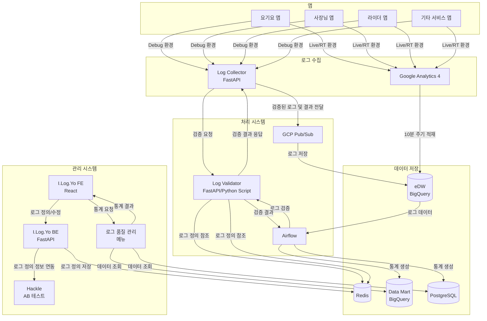
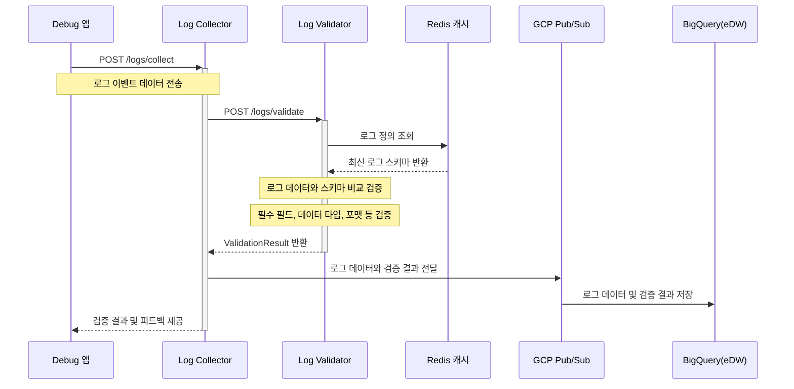
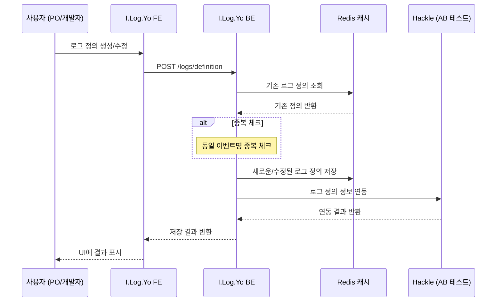
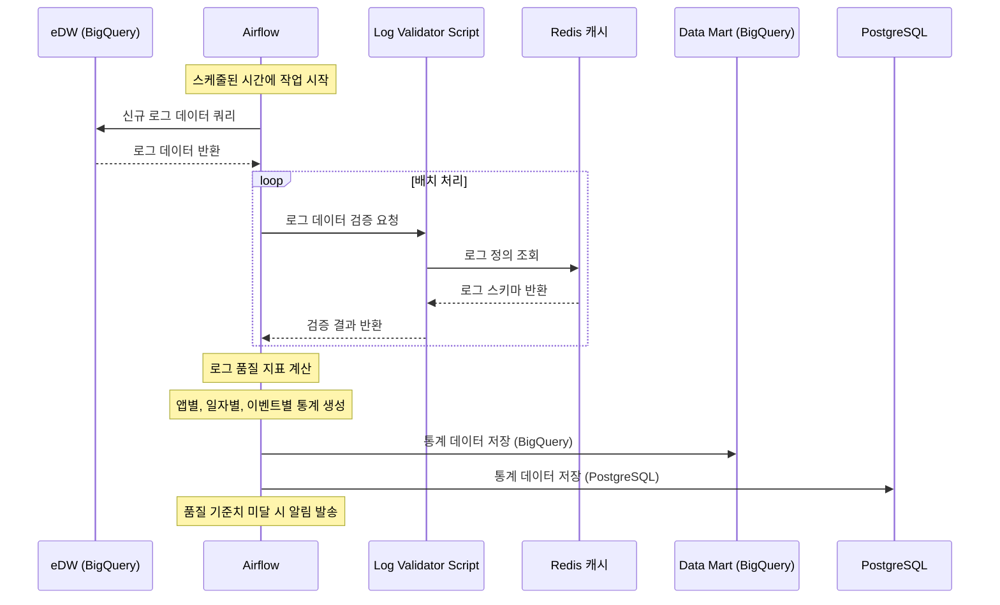
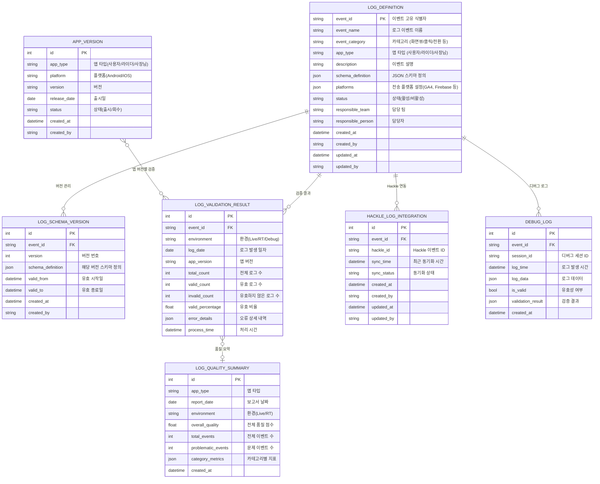

# 로그 관리 시스템 (I.Log.Yo: I.Log.You) 아키텍처

> ⚠️ 이 문서는 기억을 토대로 바이브코딩을 통해 Cursor, MCP, Claude-3.7-sonnet을 이용하여 작성되어 실제와 다를 수 있음을 알려드립니다.

```mermaid
graph TB
    subgraph "외부 시스템"
        APPS[다양한 앱<br>사용자 앱/라이더 앱/사장님 앱]
        HACKLE[Hackle<br>AB 테스트]
        GA4[Google Analytics 4]
        EDW[(eDW<br>BigQuery)]
    end

    subgraph ILOGYO_ENV["환경별 GCP 프로젝트"]
        subgraph DEBUG_PROJECT["Debug 환경 프로젝트"]
            subgraph "GKE 클러스터 - Debug"
                subgraph "인그레스 - Debug"
                    Ingress_Debug[Nginx Ingress]
                end
                
                subgraph "I.Log.Yo 네임스페이스 - Debug"
                    ILOGYO_FE_DEBUG[I.Log.Yo FE<br>React]
                    ILOGYO_BE_DEBUG[I.Log.Yo BE<br>FastAPI]
                    subgraph "I.Log.Yo BE 내 기능 - Debug"
                        LOG_QUALITY_DEBUG[로그 품질 관리<br>통계 대시보드]
                    end
                end

                subgraph "Debug 환경 전용 서비스"
                    LOG_COLLECTOR[Log Collector<br>FastAPI]
                    LOG_VALIDATOR[Log Validator<br>FastAPI]
                end
            end

            subgraph "GCP 인프라 - Debug"
                GCP_NETWORK_DEBUG[네트워크/방화벽]
                GCP_IAM_DEBUG[IAM/권한]
                REDIS_DEBUG[(Redis)]
                POSTGRES_DEBUG[(PostgreSQL)]
                GCP_AR_DEBUG[GCP Artifact Registry]
                PUBSUB_DEBUG[GCP Pub/Sub]
            end
        end

        subgraph RTLIVE_PROJECT["RT/Live 환경 프로젝트"]
            subgraph "GKE 클러스터 - RT/Live"
                subgraph "인그레스 - RT/Live"
                    Ingress_RTLive[Nginx Ingress]
                end
                
                subgraph "I.Log.Yo 네임스페이스 - RT/Live"
                    ILOGYO_FE_RTLIVE[I.Log.Yo FE<br>React]
                    ILOGYO_BE_RTLIVE[I.Log.Yo BE<br>FastAPI]
                    subgraph "I.Log.Yo BE 내 기능 - RT/Live"
                        LOG_QUALITY_RTLIVE[로그 품질 관리<br>통계 대시보드]
                    end
                end
            end

            subgraph "GCP 인프라 - RT/Live"
                GCP_NETWORK_RTLIVE[네트워크/방화벽]
                GCP_IAM_RTLIVE[IAM/권한]
                REDIS_RTLIVE[(Redis)]
                POSTGRES_RTLIVE[(PostgreSQL)]
                GCP_AR_RTLIVE[GCP Artifact Registry]
            end
        end

        subgraph "데이터 파이프라인"
            AIRFLOW[Airflow]
            MART[(Data Mart<br>BigQuery)]
        end
    end

    subgraph "인프라/관리"
        HELM[Helm]
        TERRAFORM[Terraform]
        ARGOCD[ArgoCD]
        DATADOG[Datadog]
        GH_ACTIONS[GitHub Actions]
    end

    APPS -- "Debug 환경" --> LOG_COLLECTOR
    LOG_COLLECTOR --> LOG_VALIDATOR
    LOG_VALIDATOR --> LOG_COLLECTOR
    LOG_COLLECTOR --> PUBSUB_DEBUG
    PUBSUB_DEBUG --> EDW
    
    APPS -- "Live/RT 환경" --> GA4
    
    GA4 --> EDW
    
    Ingress_Debug --> ILOGYO_FE_DEBUG
    ILOGYO_FE_DEBUG --> ILOGYO_BE_DEBUG
    
    Ingress_RTLive --> ILOGYO_FE_RTLIVE
    ILOGYO_FE_RTLIVE --> ILOGYO_BE_RTLIVE
    
    ILOGYO_BE_DEBUG --> REDIS_DEBUG
    ILOGYO_BE_DEBUG --> HACKLE
    
    ILOGYO_BE_RTLIVE --> REDIS_RTLIVE
    ILOGYO_BE_RTLIVE --> HACKLE
    
    EDW --> AIRFLOW
    AIRFLOW -- "Python Script로<br>Log Validator 로직 활용" --> REDIS_DEBUG
    AIRFLOW -- "Python Script로<br>Log Validator 로직 활용" --> REDIS_RTLIVE
    AIRFLOW --> MART
    AIRFLOW --> POSTGRES_DEBUG
    AIRFLOW --> POSTGRES_RTLIVE
    
    LOG_QUALITY_DEBUG --> MART
    LOG_QUALITY_DEBUG --> POSTGRES_DEBUG
    ILOGYO_BE_DEBUG --> MART
    
    LOG_QUALITY_RTLIVE --> MART
    LOG_QUALITY_RTLIVE --> POSTGRES_RTLIVE
    ILOGYO_BE_RTLIVE --> MART
    
    GH_ACTIONS --> GCP_AR_DEBUG
    GH_ACTIONS --> GCP_AR_RTLIVE
    ARGOCD --> ILOGYO_FE_DEBUG
    ARGOCD --> ILOGYO_BE_DEBUG
    ARGOCD --> LOG_COLLECTOR
    ARGOCD --> LOG_VALIDATOR
    ARGOCD --> ILOGYO_FE_RTLIVE
    ARGOCD --> ILOGYO_BE_RTLIVE

    DATADOG --> ILOGYO_FE_DEBUG
    DATADOG --> ILOGYO_BE_DEBUG
    DATADOG --> LOG_COLLECTOR
    DATADOG --> LOG_VALIDATOR
    DATADOG --> ILOGYO_FE_RTLIVE
    DATADOG --> ILOGYO_BE_RTLIVE

    HELM --> ARGOCD
    
    TERRAFORM -->|관리| ILOGYO_ENV
```

## 아키텍처 설명

### 서비스 구성
1. **I.Log.Yo FE**
   - React 기반 프론트엔드
   - 로그 정의, 관리, 통계 조회를 위한 웹 인터페이스 제공

2. **I.Log.Yo BE**
   - FastAPI, Python 기반
   - 로그 스키마 관리 및 정의
   - Redis를 통한 로그 정의 캐싱
   - 로그 정의 정보만 Hackle에 연동
   - 로그 품질 관리 메뉴 (Log Quality) 제공

3. **Log Collector**
   - FastAPI, Python 기반
   - Debug 환경 전용 서비스
   - 앱에서 전송하는 실시간 행동 로그 수집
   - 수집된 로그를 Log Validator로 전달하여 정합성 검증
   - Log Validator로부터 검증 결과를 응답 받으면 전송된 로그와 검증 결과를 GCP Pub/Sub에 전달하여 BigQuery에 저장

4. **Log Validator**
   - FastAPI, Python 기반
   - Debug 환경에서 실시간으로 로그 스키마와 수집된 로그 데이터 간의 정합성 검증
   - Redis에서 최신 로그 정의 정보 참조
   - 검증 결과를 Log Collector에 응답
   - RT/Live 환경에서는 동일한 소스코드가 Airflow의 Python script로 활용됨

### 환경별 시스템 구성
- 환경별(RT/Live, Debug) 시스템은 각기 다른 GCP 프로젝트로 구성됨
- 각 프로젝트는 독립적인 GKE 클러스터, Redis, PostgreSQL 등 인프라 구성을 가짐

### 환경별 데이터 흐름
1. **Debug 환경**
   - 앱 → Log Collector → Log Validator → Log Collector → GCP Pub/Sub → BigQuery(eDW) → 통계 처리 시스템(Airflow) → Data Mart(BigQuery) 및 PostgreSQL
   - 실시간 로그 정합성 검증 및 피드백 제공

2. **RT(Regression Test/스테이징) 환경**
   - 앱 → GA4 → eDW(BigQuery) → 통계 처리 시스템(Airflow) → Data Mart(BigQuery) 및 PostgreSQL
   - Airflow에서 Log Validator의 로직을 Python script로 활용하여 검증
   - 준실시간 로그 정합성 검증 및 품질 모니터링

3. **Live(운영) 환경**
   - 앱 → GA4 및 기타 플랫폼 → eDW(BigQuery) → 통계 처리 시스템(Airflow) → Data Mart(BigQuery) 및 PostgreSQL
   - Airflow에서 Log Validator의 로직을 Python script로 활용하여 검증
   - 대규모 데이터 기반 로그 품질 모니터링 및 통계 생성

### 인프라 구성
- **GKE 클러스터**: Helm 차트로 관리, 환경별로 별도 구성
- **서비스 구성**: I.Log.Yo, Debug 환경 전용 서비스로 구분
- **Nginx Ingress**: 외부 트래픽 라우팅 및 로드 밸런싱
- **CI/CD**: GitHub Actions → GCP Artifact Registry → ArgoCD
- **모니터링**: Datadog
- **클라우드 관리**: Terraform으로 GCP 리소스 관리

### 통합 시스템
- **Hackle 연동**: 로그 정의 정보 연동
- **GA4 연동**: 앱에서 생성되는 이벤트 데이터 수집
- **BigQuery**: 데이터 저장 및 분석 플랫폼
- **GCP Pub/Sub**: Debug 환경의 로그를 BigQuery로 전달하는 중간 매개체

### 성능 최적화
- Redis 캐싱을 통한 로그 정의 정보 빠른 접근
- 배치 처리와 실시간 처리의 적절한 조합으로 확장성 확보
- 마이크로서비스 아키텍처로 개별 서비스의 독립적 확장 가능

## 데이터 플로우

### 데이터 플로우 설명

#### Debug 환경 데이터 흐름
1. 요기요 앱, 사장님 앱, 라이더 앱 및 기타 서비스 앱들에서 Debug 환경으로 사용자 행동 로그를 Log Collector로 전송
2. Log Collector는 Log Validator에 정합성 검증 요청
3. Log Validator는 Redis에서 최신 로그 정의 정보를 참조하여 검증 수행
4. 검증 결과를 Log Collector로 응답
5. Log Collector는 원본 로그와 검증 결과를 함께 GCP Pub/Sub으로 전달
6. GCP Pub/Sub은 수신한 로그와 검증 결과를 BigQuery(eDW)에 저장
7. 개발자는 즉시 로그 정합성 피드백을 받고 수정 가능

#### Live/RT 환경 데이터 흐름
1. 요기요 앱, 사장님 앱, 라이더 앱 및 기타 서비스 앱들에서 Live/RT 환경으로 사용자 행동 데이터를 GA4로 전송
2. GA4는 약 10분 주기로 데이터를 BigQuery의 eDW에 적재
3. Airflow는 스케줄에 따라 eDW에서 로그 데이터를 추출
4. Airflow에서 Log Validator의 로직(Debug 환경과 동일한 소스코드)을 실행하여 로그 정합성 검증
5. 검증 결과와 함께 로그 품질 관련 통계 생성
6. 생성된 통계 데이터는 Data Mart(BigQuery)와 PostgreSQL에 저장
7. I.Log.Yo BE의 로그 품질 관리 메뉴에서 이 데이터를 활용하여 시각화 및 분석 제공

#### 로그 정의 관리
1. PO, 데이터 분석가, 개발자가 I.Log.Yo FE를 통해 로그 정의 및 수정
2. I.Log.Yo BE는 이 정의를 처리하고 Redis에 최신 정보 저장
3. I.Log.Yo BE는 로그 정의 정보를 Hackle에 연동
4. Log Validator는 Redis에서 최신 로그 정의를 참조하여 검증 수행

#### 통계 조회 및 모니터링
1. I.Log.Yo FE의 로그 품질 관리 메뉴를 통해 통계 조회 요청
2. I.Log.Yo BE는 Data Mart(BigQuery)와 PostgreSQL에서 필요한 통계 데이터 추출
3. 추출된 데이터를 가공하여 시각화 및 분석 자료로 제공
4. 앱별, 일자별, 로그 이벤트별 품질 지표 모니터링

## 시퀀스 다이어그램

### Debug 환경에서의 로그 검증 프로세스

### 로그 정의 관리 프로세스

### 로그 품질 통계 생성 프로세스

이 시퀀스 다이어그램은 I.Log.Yo 시스템의 주요 프로세스를 보여줍니다:

1. **Debug 환경에서의 로그 검증 프로세스**
   - 개발 중인 앱에서 Log Collector를 통해 로그를 전송하고 즉각적인 검증 피드백
   - Log Validator는 검증 결과를 Log Collector에 응답
   - Log Collector는 로그 데이터와 검증 결과를 GCP Pub/Sub으로 전달하여 BigQuery에 저장
   - 개발 단계에서 로그 정합성 문제를 조기에 발견하고 수정 가능

2. **로그 정의 관리 프로세스**
   - PO/개발자가 UI를 통해 로그 정의를 생성하고 관리
   - 로그 정의 정보를 Hackle에 연동
   - Redis 캐싱을 통한 성능 최적화

3. **로그 품질 통계 생성 프로세스**
   - Airflow 배치 작업을 통한 대량 데이터 처리
   - Log Validator 로직을 Python script로 활용하여 검증
   - 통계 데이터를 Data Mart(BigQuery)와 PostgreSQL에 저장하여 분석 및 시각화에 활용

## 데이터 모델 (ERD)

### 데이터 모델 설명

#### LOG_DEFINITION (로그 정의)
- 로그 이벤트의 기본 정의를 관리하는 테이블
- 이벤트 ID, 이름, 카테고리, 앱 타입 등 기본 정보 포함
- JSON 스키마 형태로 이벤트 데이터 구조 정의
- 플랫폼별 전송 설정 관리 (GA4, Firebase 등)
- 담당 팀과 담당자 정보 관리로 책임소재 명확화

#### LOG_SCHEMA_VERSION (로그 스키마 버전)
- 로그 스키마의 버전 관리를 위한 테이블
- 버전별 스키마 정의 저장
- 유효 기간 관리를 통한 이전 버전과의 호환성 유지
- 버전 기록을 통한 스키마 변경 이력 추적

#### LOG_VALIDATION_RESULT (로그 검증 결과)
- 로그 검증 결과를 저장하는 테이블
- 환경(Live/RT/Debug)별, 일자별, 앱 버전별 검증 결과
- 전체 로그 수, 유효 로그 수, 오류 로그 수, 유효 비율 등 통계 정보
- JSON 형태의 오류 상세 내역 저장으로 문제 분석 용이

#### APP_VERSION (앱 버전)
- 앱 버전 정보를 관리하는 테이블
- 앱 타입(사용자/라이더/사장님), 플랫폼(Android/iOS)별 버전 관리
- 출시일, 상태 등 정보 포함
- 로그 검증 결과와 연계하여 버전별 로그 품질 추적

#### HACKLE_LOG_INTEGRATION (Hackle 로그 연동)
- Hackle에 연동된 로그 정의 정보 관리
- 로그 이벤트와 Hackle 이벤트 간의 매핑 정보
- 동기화 상태 및 시간 기록
- 연동 이력 관리

#### DEBUG_LOG (디버그 로그)
- Debug 환경에서 수집된 로그 데이터 저장
- 개발 단계에서의 로그 검증에 활용
- 세션 ID를 통한 디버그 세션 관리
- 검증 결과와 함께 저장되어 개발자에게 피드백 제공

#### LOG_QUALITY_SUMMARY (로그 품질 요약)
- 앱 타입별, 환경별, 날짜별 로그 품질 지표 요약
- 전체 품질 점수, 문제 이벤트 수 등 종합 지표
- 카테고리별 품질 지표를 JSON 형태로 저장
- 대시보드 및 리포트 생성에 활용 