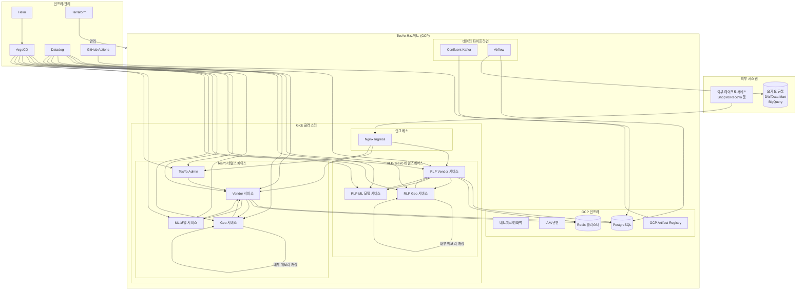
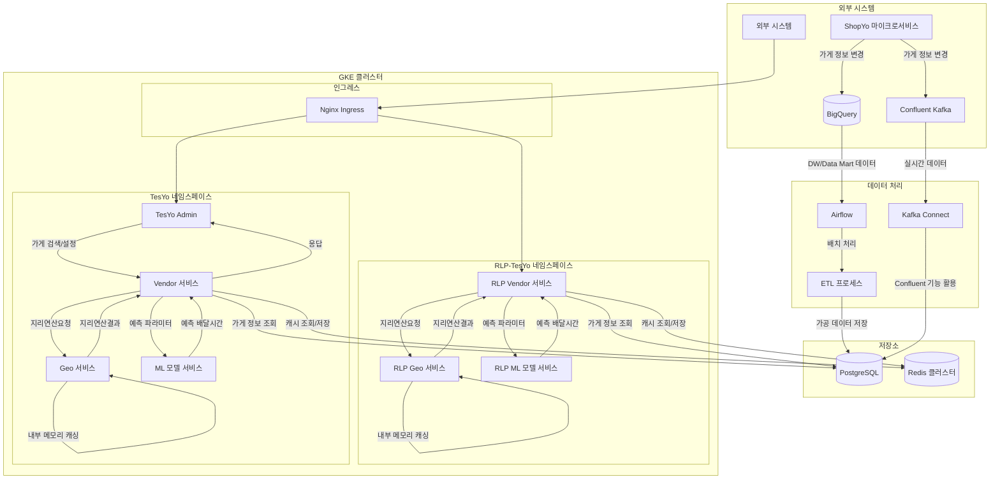
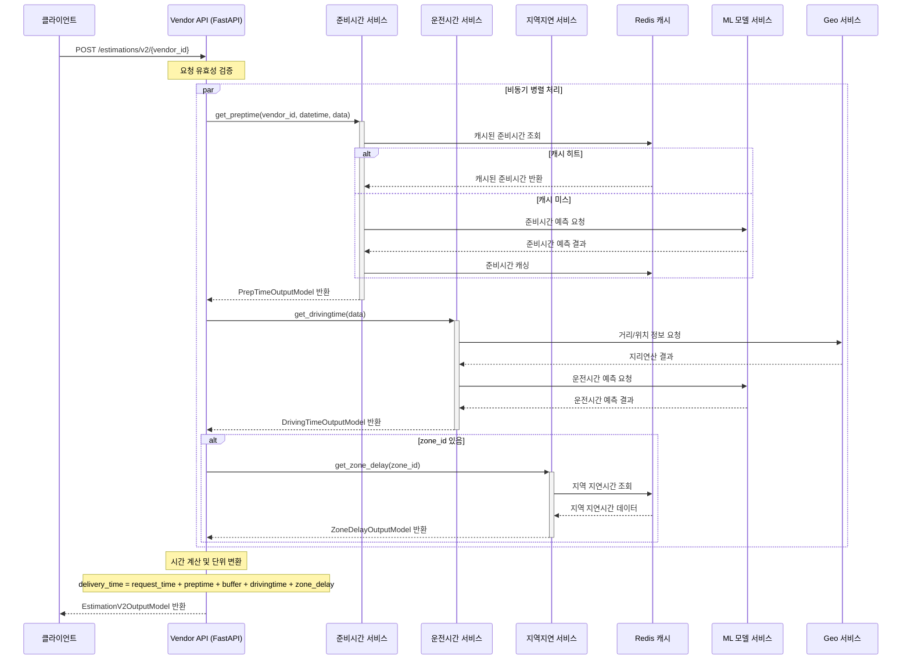
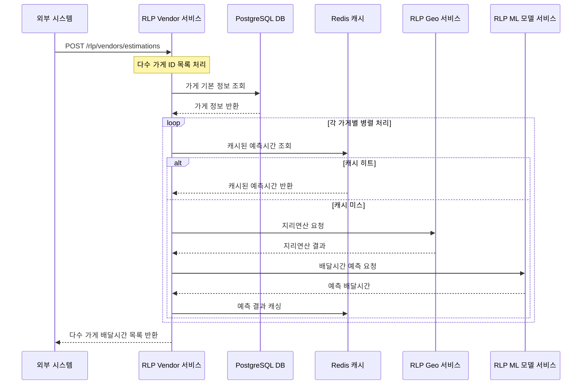
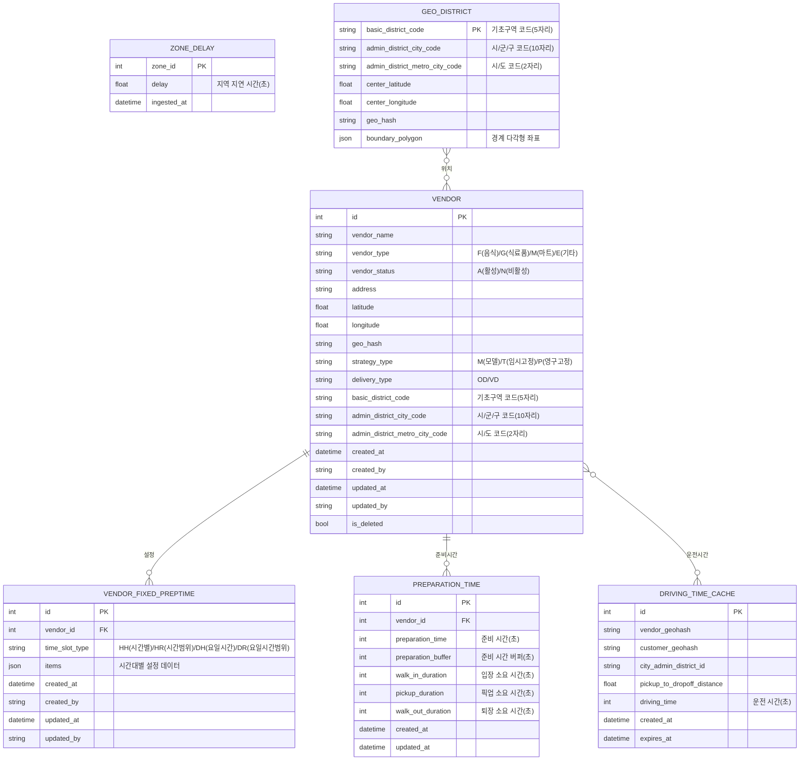

# 배달시간 예측 시스템 (TesYo: Time Estimation System) 아키텍처

> ⚠️ 이 문서는 기억을 토대로 바이브코딩을 통해 Cursor, MCP, Claude-3.7-sonnet을 이용하여 작성되어 실제와 다를 수 있음을 알려드립니다.

## 아키텍처 설명

### 서비스 구성
1. **Vendor 서비스**
   - FastAPI, Python 기반
   - 가게 기본 정보 관리 (ID, 주소, 배달시간 설정, 모델 예측 사용 여부)
   - PostgreSQL DB 사용
   - Redis 캐싱 적용 (최근 조회 가게 예측시간)

2. **Geo 서비스**
   - FastAPI, Python 기반
   - 지리 연산 담당 (거리 계산, geo hash, reverse geocoding 등)
   - 자체 메모리에 지역 정보 데이터 캐싱
   - ML 모델 예측에 필요한 파라미터 제공

3. **ML 모델 서비스**
   - 배달시간 예측 모델
   - 파라미터 기반 예측 배달시간 응답

4. **TesYo Admin**
   - React, TypeScript, Next.js 기반
   - 가게 검색, 정보 조회 및 설정 기능

### API 구성
- **RLP(Restaurant List Prep-time) API**: 다수 가게의 배달시간 예측 처리 (가게 목록, 검색 결과)
- **일반 API**: 단일 가게의 정확한 배달시간 예측 (가게 상세, 주문 후)

### 인프라 구성
- **GKE 클러스터**: Helm 차트로 관리
- **네임스페이스 분리**: RLP-TesYo, TesYo 별도 관리 및 Scaling
- **Nginx Ingress**: 외부 트래픽을 각 서비스로 라우팅, 클러스터 내 서비스에 대한 단일 진입점 제공, 경로 기반 라우팅 및 로드 밸런싱 수행
- **CI/CD**: GitHub Actions → GCP Artifact Registry → ArgoCD
- **모니터링**: Datadog (인그레스 트래픽 기반 k8s auto scaling)
- **클라우드 관리**: Terraform으로 GCP 리소스 전체 관리 (GKE, 데이터베이스, 네트워크, IAM, 스토리지 등)

### 데이터 흐름
1. **기본 데이터 파이프라인**: BigQuery DW/Data Mart → Airflow 배치 → PostgreSQL
2. **실시간 데이터 동기화**: Confluent Kafka Topic → PostgreSQL (Confluent 기능 활용)
3. **캐싱**: 자주 접근하는 데이터는 Redis 클러스터에 저장, 지리 정보는 Geo 서비스 내부 메모리에 캐싱

### 배포 전략
- 컨테이너 이미지는 버전과 latest 태그로 Artifact Registry에 저장
- ArgoCD를 통한 자동 배포
- 버전 태그를 이용한 카나리 배포 지원

### 성능 최적화
- Redis 클러스터 기반 가게 정보 및 예측 결과 캐싱
- Geo 서비스 자체 메모리 캐싱을 통한 지리 연산 성능 향상
- 트래픽 패턴 분석 기반 CronJob으로 피크타임 2시간 전 자동 스케일아웃
- 멀티스테이지 빌드를 적용한 컨테이너 경량화
- 마이크로서비스별 CPU/메모리 사용량 최적화

### 시스템 확장성
- 마이크로서비스 아키텍처로 인한 독립적 스케일링 가능
- 네임스페이스 분리를 통한 리소스 관리 효율화
- 자동화된 CI/CD 파이프라인으로 빠른 배포 및 롤백 지원

## 데이터 플로우

### 데이터 플로우 설명

#### 배치 데이터 처리
1. **BigQuery → Airflow → PostgreSQL**:
   - BigQuery의 DW/Data Mart에서 배달 관련 데이터 추출
   - Airflow를 통한 정기적 ETL 작업 수행
   - 가공된 데이터를 PostgreSQL에 저장하여 서비스에서 사용

2. **ShopYo → BigQuery**:
   - 가게 정보 관리 마이크로서비스(ShopYo)에서 발생한 정보 변경이 BigQuery에 배치로 반영
   - 이후 Airflow 배치를 통해 정제된 형태로 서비스 DB에 반영

#### 실시간 데이터 동기화
1. **ShopYo → Kafka → PostgreSQL**:
   - 가게 정보 관리 마이크로서비스(ShopYo)에서 변경 사항 발생
   - Confluent Kafka를 통해 실시간으로 이벤트 전파
   - Kafka Connect를 활용하여 변경 데이터를 직접 PostgreSQL에 반영 (Confluent 기능 활용)

#### API 요청 처리 흐름
1. **일반 API (단일 가게 요청)**:
   - TesYo Admin에서 Vendor 서비스로 직접 요청
   - Vendor 서비스는 가게 정보를 PostgreSQL에서 조회 (Redis 캐시 활용)
   - Geo 서비스에 지리연산요청
   - ML 모델 서비스에 파라미터 전달하여 배달시간 예측
   - 종합된 정보를 응답으로 반환

2. **RLP API (다수 가게 요청)**:
   - 외부 시스템에서 Nginx 인그레스를 통해 RLP Vendor 서비스로 직접 요청
   - RLP Vendor 서비스에서 병렬 처리
   - RLP Geo 서비스와 RLP ML 모델 서비스를 활용한 대량 연산
   - 최적화된 성능으로 다수 가게의 배달시간 일괄 응답

#### 쿠버네티스 클러스터 구성
- RLP-TesYo와 TesYo 네임스페이스가 동일한 GKE 클러스터 내에 구성됨
- 각 네임스페이스는 독립적으로 스케일링되며 리소스 관리
- Nginx 인그레스가 외부 요청을 적절한 서비스로 라우팅

#### 캐싱 전략
1. **Redis 캐싱**:
   - 최근 조회된 가게 정보 및 예측 결과 캐싱
   - 캐시 갱신 정책: 시간 기반 만료 + 이벤트 기반 무효화

2. **메모리 내 캐싱**:
   - Geo 서비스 내 지역 정보 데이터를 자체 메모리에 캐싱
   - RLP Geo 서비스도 자체 메모리에 지역 정보 데이터 캐싱

## 시퀀스 다이어그램

### 단일 가게 배달시간 예측 (Vendor 서비스)

### 다수 가게 배달시간 예측 (RLP Vendor 서비스)

위 시퀀스 다이어그램은 배달시간 예측 시스템의 주요 흐름을 보여줍니다:

1. **단일 가게 배달시간 예측 (Vendor 서비스)**
   - 클라이언트에서 특정 가게(vendor_id)의 배달시간 예측 요청
   - 준비시간, 운전시간, 지역지연시간을 병렬로 비동기 처리
   - Redis 캐시를 활용한 성능 최적화
   - 최종 배달시간 계산 및 반환

2. **다수 가게 배달시간 예측 (RLP Vendor 서비스)**
   - 외부 시스템에서 여러 가게의 배달시간 예측 요청
   - 대량 데이터 처리를 위한 최적화된 흐름
   - Redis 캐시를 통한 반복 요청 최적화
   - 병렬 처리를 통한 대규모 요청 처리

## 데이터베이스 아키텍처 (ERD)

### 데이터베이스 스키마 설명

#### VENDOR (공급업체)
- 공급업체 기본 정보를 관리하는 테이블
- 위치 정보(위도/경도), 주소, 상태 등 저장
- 타입과 전략 타입에 따라 배달시간 예측 방식 결정
- 지리 정보(행정구역 코드, 기초구역 코드 등) 포함

#### VENDOR_FIXED_PREPTIME (고정 준비시간 설정)
- 공급업체가 모델 대신 고정 준비시간을 사용할 경우의 설정값
- 시간대 타입에 따라 다양한 시간대별 설정 가능
- 시간별(HH), 시간범위(HR), 요일시간별(DH), 요일시간범위(DR) 등 유연한 설정

#### ZONE_DELAY (지역 지연시간)
- 특정 지역(Zone)의 추가 지연시간 정보
- 교통 상황, 지역 특성 등을 반영한 지연 시간
- 배달시간 예측에 추가로 반영됨

#### PREPARATION_TIME (준비시간)
- 공급업체별 음식 준비시간 정보
- 준비시간, 버퍼, 입장/픽업/퇴장 소요시간 포함
- ML 모델에 의해 예측되거나 고정값으로 설정

#### DRIVING_TIME_CACHE (운전시간 캐시)
- 자주 요청되는 경로의 운전시간을 캐싱하는 테이블
- 공급업체에서 고객까지의 거리와 운전시간 저장
- 성능 최적화를 위해 유효기간 관리

#### GEO_DISTRICT (지리 구역)
- 기초구역 코드와 행정구역 코드를 관리하는 테이블
- 구역의 중심 좌표와 지오해시 정보 포함
- 경계 다각형 좌표를 통해 정확한 지역 범위 정의

이 데이터베이스 아키텍처는 배달시간 예측을 위한 핵심 데이터 구조를 보여줍니다. 공급업체 정보, 준비시간, 운전시간, 지리 정보가 유기적으로 연결되어 정확한 배달시간을 예측하는 데 활용됩니다.

ML 모델은 이러한 데이터를 학습하여 다양한 조건(주문량, 시간대, 지역 등)에 따른 배달시간을 예측하며, 캐싱 전략을 통해 서비스 성능을 최적화합니다.
